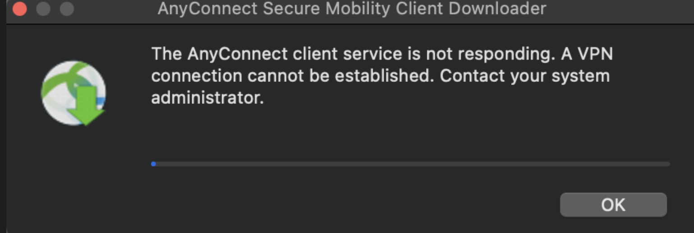

# Issues 

Cisco VPN could not launch [resolution](https://community.cisco.com/t5/vpn/the-vpn-service-is-not-available-exiting-on-a-mac-osx-catalina/td-p/4055552)

```zsh
lauchctl load /Library/LaunchAgents/com.cisco.anyconnect.notification.plist


launchctl load /Library/LaunchDaemons/com.cisco.anyconnect.vpnagentd.plist
```


